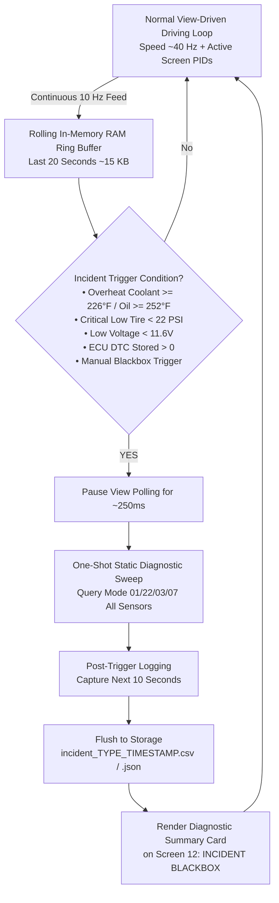

# MX-5 Dash: Future Enhancements & Backlog (TODO Eventually)

This document serves as the design specification and implementation blueprint for features planned for future development cycles.

---

## 1. Flight Recorder / Blackbox Incident Auto-Dumper

### Overview & Motivation
During driving sessions and track events, running a global high-frequency poll of 20+ OBD-II PIDs simultaneously degrades Bluetooth Classic (RFCOMM) and BLE bandwidth, dropping the primary speedometer refresh rate from ~40 Hz down to 3–4 Hz. 

To preserve real-time driving responsiveness while still providing complete diagnostic data for repairs and tuning, the system uses a **Hybrid Blackbox Recorder**:
1. **Pre-Trigger Context**: Rolling in-memory ring buffer (last 20 seconds).
2. **Moment-of-Fault Freeze Sweep**: Instantaneous static query of all powertrain, chassis, and DTC PIDs (250ms one-shot).
3. **Post-Trigger Context**: 10 seconds of aftermath logging.
4. **Structured Incident Export**: Automated CSV/JSON generation and on-screen summary card.



---

### Implementation Architecture

#### A. Rolling Pre-Trigger RAM Ring Buffer
* **Storage Requirement**: Circular buffer holding 200 telemetry snapshots (20 seconds @ 10 Hz).
* **Memory Footprint**: ~15 KB (safe for both Android and ESP32-S3 internal SRAM).
* **Data Fields**:
  * Timestamp (ms)
  * Vehicle Speed (mph / km/h)
  * Engine RPM & Gear
  * Throttle Position % (calibrated 0–100%)
  * Engine Load %
  * Coolant Temp (°F / °C)
  * Oil Temp (°F / °C)
  * Battery Voltage (V)
  * Active Screen Index

#### B. Trigger Detection Conditions
1. **Engine Thermal Overheat**:
   * Coolant Temp $\ge 226^\circ\text{F}$ ($108^\circ\text{C}$) or Oil Temp $\ge 252^\circ\text{F}$ ($122^\circ\text{C}$).
2. **Severe Tire Pressure Loss**:
   * Any TPMS tire pressure $< 22.0\text{ PSI}$ while vehicle speed $> 10\text{ MPH}$.
3. **Charging System Failure**:
   * Battery voltage $< 11.6\text{V}$ while engine RPM $> 600$.
4. **Active Diagnostic Trouble Code**:
   * New DTC flagged in PCM/ABS module (`dtcCount > 0`).
5. **Manual Flag**:
   * User taps "RECORD INCIDENT" button on Track Screen or Menu Hub.

#### C. Instant Static Freeze Sweep (250ms Execution)
When a trigger fires, the polling worker momentarily pauses the normal loop and dispatches a single burst of queries:
* **Mode 01 Core**:
  * `010C` (RPM), `0104` (Calculated Load), `0105` (Coolant ECT), `010F` (Intake IAT), `0111` (Throttle), `0142` (Module Voltage).
* **Mode 01 Diagnostics & Fuel Trims**:
  * `0106` (STFT Bank 1), `0107` (LTFT Bank 1), `0123` (Fuel Rail Pressure), `0124` (Wideband Lambda/AFR), `010E` (Ignition Timing Advance).
* **Mode 22 SkyActiv Proprietary DIDs**:
  * `221310` (Engine Oil Temp).
  * `222A05`..`08` via header `720` (4-Corner Tire Pressures & Temps).
* **Mode 03 / 07 DTCs**:
  * Exact confirmed and pending diagnostic trouble codes.

#### D. File Storage & Output Format
* **File Naming Convention**:
  * Android: `/sdcard/Documents/MX5_Logs/incident_[TYPE]_[YYYY-MM-DD_HHMMSS].csv`
  * ESP32: `/sdcard/incidents/inc_[TYPE]_[TIMESTAMP].csv`
* **CSV Schema**:
  ```csv
  # MX-5 ND2 INCIDENT REPORT
  # Trigger: COOLANT_OVERHEAT (228 F)
  # Incident Time: 2026-09-04 16:48:12 EDT
  # DTC Codes: P0128
  # Static Snapshot: RPM=4250, Speed=58mph, Load=82%, FRP=2150psi, AFR=13.2, STFT=+3.1%, LTFT=+1.5%, Bat=14.1V
  # Pre-Trigger (20s) & Post-Trigger (10s) Telemetry Trace:
  timestamp_ms,rel_sec,speed_mph,rpm,gear,throttle_pct,load_pct,coolant_f,oil_f,bat_v
  -20000,-20.0,55,3800,5,42,65,212,220,14.2
  ...
  0,0.0,58,4250,5,55,82,228,245,14.1  <-- TRIGGER POINT
  ...
  +10000,+10.0,0,850,N,0,18,225,242,13.9
  ```

#### E. Dash UI Integration (Screen 12: INCIDENT BLACKBOX)
* Displays a dedicated incident playback card on Screen 12:
  * Incident Header badge with severity color (Red for Overheat / Low Tire, Amber for Warning).
  * 3-Key Metric Callouts: Trigger Value, Speed at Fault, Load/RPM at Fault.
  * Interactive "VIEW REPAIR CHECKLIST" button linking to technical troubleshooting steps for the detected condition.
